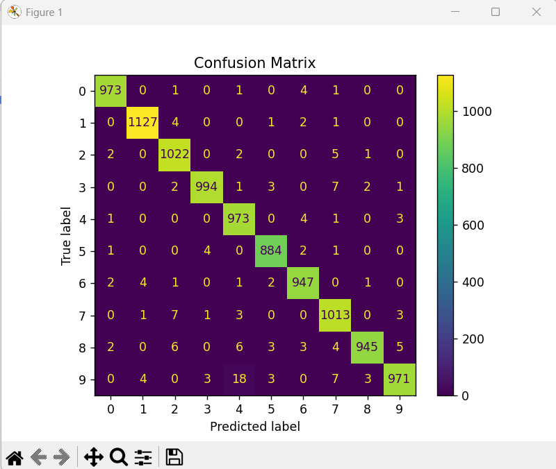

# Week 1: LeNet 논문 구현 및 실험 재현

> **Gradient-Based Learning Applied to Document Recognition**  
> Yann LeCun, Léon Bottou, Yoshua Bengio, Patrick Haffner (1998)

---

## 🧪 실험 목표

- 고전적 CNN 구조인 **LeNet-1, LeNet-5**를 직접 구현
- 논문에 기술된 손실 함수(MSE, Discriminative), 학습 전략(SGD+momentum), 시각화(Fig.6~10) 등을 재현
- 데이터 증강, 오답 시각화, Rejection 평가 등 다양한 실험 수행
- 앙상블 및 연산량 비교를 통해 구조 간 정확도와 효율성 분석

---

## 📁 파일 구성

| 파일명 | 설명 |
|--------|------|
| `train.py` | LeNet-5 학습/검증 전체 파이프라인 |
| `train_lenet1.py` | LeNet-1 학습 실험 |
| `boosted_lenet4.py` | LeNet-4 앙상블 (3개 모델 평균) 실험 |
| `lenet5_model.py` | LeNet-5 구조 정의 |
| `lenet1_model.py` | LeNet-1 구조 정의 |
| `generate_augmented_dataset.py` | 증강 이미지 고정 생성 (`.npy` 저장) |
| `plot_training_iterations.py` | Fig.6(좌): 반복횟수 vs 오류율 |
| `plot_training_size.py` | Fig.6(우): 훈련셋 크기 vs 오류율 |
| `visualize_misclassified.py` | Fig.8 대응, 오답 샘플 시각화 함수 |
| `model_stats.py` | 모델별 FLOPs, 파라미터 수 계산 |
| `utils.py` | 유틸 함수 모음 (시각화 등)

---

## ✅ 주요 구현 내용

- [x] LeNet-5 모델 구조 구현
- [x] LeNet-1, LeNet-4 모델 비교
- [x] MSE 손실 함수 + SGD(momentum) 학습
- [x] Discriminative Loss (논문식 기반) 구현
- [x] 데이터 증강 (`ImageDataGenerator` / 고정 `.npy`)
- [x] 오답 시각화 (정답/예측 표시)
- [x] Rejection Mechanism (예측 불확실 시 제외)
- [x] 모델 구조별 FLOPs 및 파라미터 수 비교

---

## ▶️ 실행 방법

```bash
# LeNet-5 학습
python train.py

# LeNet-1 비교 실험
python train_lenet1.py

# LeNet-4 앙상블
python boosted_lenet4.py

# 데이터 증강 파일 생성 (540,000 샘플)
python generate_augmented_dataset.py

# 시각화 (그래프)
python plot_training_iterations.py
python plot_training_size.py
```

---

## 📊 실험 결과 요약

| 모델              | Test Accuracy | Error Rate | Parameters | FLOPs   |
|-------------------|---------------|------------|------------|---------|
| LeNet-1           | 약 97.8%      | 약 2.2%     | ~18K       | ~0.5M   |
| LeNet-4 (Ensemble)| 약 98.8%      | 약 1.2%     | ~300K      | ~4M     |
| **LeNet-5**       | **98.49%**    | **1.51%**   | ~431K      | ~9.6M   |

- 정확도는 **LeNet-5 > LeNet-4 > LeNet-1** 순으로,  
  구조의 복잡도와 연산량 대비 성능 향상을 명확히 확인할 수 있다.
- LeNet-5는 **Discriminative Loss**와 **데이터 증강** 적용 시 매우 높은 정확도를 보임.

### Rejection 평가 (논문 Fig.10 대응)

| Rejection Threshold | Accuracy (Accepted Only) | Rejection Rate |
|---------------------|---------------------------|----------------|
| 0.20                | **99.48%**                | 2.61%          |
| 0.10                | 99.09%                    | 1.26%          |
| 0.05                | 98.83%                    | 0.67%          |

- 예측 신뢰도가 낮은 샘플을 제외(Rejection)하면 **정확도가 상승**함을 확인
- 논문에서 주장한 selective prediction 전략이 실험적으로 검증됨.

## 🖼️ 참고 시각화 결과

### Confusion Matrix (논문 Fig.9 대응)

- 모델이 어떤 클래스에서 오류를 자주 발생시키는지 시각적으로 보여준다.
- 실제 실험에서도 `4 ↔ 9`, `5 ↔ 3`, `8 ↔ 2` 등 구조 유사성에 의한 혼동이 발생



### 오답 샘플 시각화 (논문 Fig.8 대응)

- 정답(T)과 예측(P)을 함께 표시하여 **CNN 모델이 놓치는 시각적 특징**을 분석할 수 있다.
- `T:9 → P:4`, `T:8 → P:2`, `T:7 → P:4` 등에서 형태적 유사성 확인 가능


---

## 📚 참고 자료

- 📄 [논문 원문 (IEEE)](https://ieeexplore.ieee.org/document/726791)
- 📘 [Yann LeCun의 LeNet 소개 페이지](http://yann.lecun.com/exdb/lenet/)
- 🧠 [keras-flops](https://pypi.org/project/keras-flops/) : 모델 연산량(FLOPs) 계산 라이브러리
