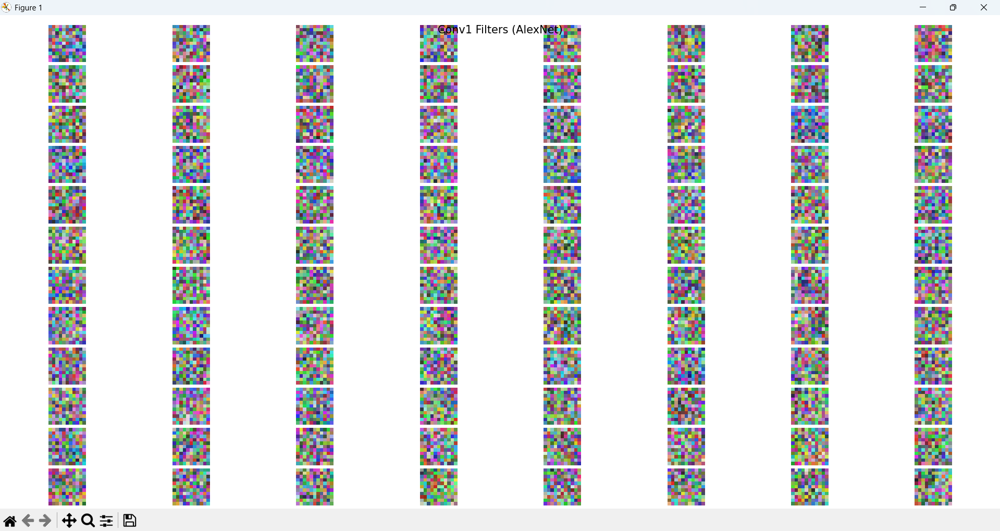

# Week 2: AlexNet 논문 구현 및 CIFAR‑10 실험

> **ImageNet Classification with Deep Convolutional Neural Networks**  
> Alex Krizhevsky, Ilya Sutskever, Geoffrey Hinton (2012)

---

## 🧪 실험 목표

- ILSVRC 2012 우승 모델 **AlexNet**을 기반으로 CIFAR‑10 데이터에 대해 학습 파이프라인 구현
- 논문 핵심 요소(**LRN, ReLU, Overlapping Pooling, Dropout** 등)를 직접 구현해 동작 방식 이해
- PCA 기반 Color Augmentation(Lighting)을 포함하여 논문의 데이터 증강 일부 재현
- Conv1 필터 시각화 및 FC feature 기반 유사 이미지 검색으로 표현 학습 특성 분석

---

## 📁 파일 구성

| 파일명             | 설명                                                 |
| --------------- | -------------------------------------------------- |
| `train.py`      | AlexNet 학습/검증 전체 파이프라인                             |
| `alexnet.py`    | AlexNet 구조 정의 (LRN, Dropout 포함)                    |
| `dataloader.py` | CIFAR‑10 데이터 로더 + PCA Color Augmentation(Lighting) |
| `metrics.py`    | Top‑1 / Top‑5 accuracy 계산                          |
| `visualize.py`  | Conv1 필터 시각화, Nearest Neighbor 검색 기능               |

---

## ✅ 주요 구현 내용

- [x] AlexNet 전체 구조 구현 (논문 Section 3 기반)
- [x] Local Response Normalization (LRN) 구현
- [x] Overlapping Max Pooling (stride < kernel)
- [x] Dropout 적용한 Fully‑Connected 구조 재현
- [x] PCA 기반 Color Augmentation (Lighting) 구현
- [x] Conv1 필터 시각화
- [x] FC feature 기반 유사 이미지 검색 (Nearest Neighbor)

---

## ▶️ 실행 방법

```bash
# AlexNet 학습
python train.py

⚠️ CPU 환경에서는 AlexNet이 매우 느릴 수 있으므로 epoch=10, batch_size=128, 혹은 서브셋 데이터 모드를 추천
```

---

## 📊 실험 결과 요약

이번 실험은 **AlexNet**을 **CIFAR-10 데이터셋 (Subset 5천 개)** 기준으로 **10 Epoch** 학습하고,  
Conv1 필터를 시각화한 결과를 재현한 것이다.

| 항목 | 결과 |
|------|------|
| Epoch 수 | 10 |
| Train Accuracy (최종) | 25.82% |
| Test Top-1 Accuracy | 26.70% |
| Test Top-5 Accuracy | 81.30% |
| Conv1 필터 시각화 | 정상 출력됨 (96개 필터) |

```bash
🚀 [Start] Training begins...
🖥️ Using device: cpu
📦 Loading data...
✅ Data loaded!

📚 [Epoch 1/10] ------------------------------
  🔄 Batch 1/40 | Loss: 2.3020
  🔄 Batch 6/40 | Loss: 2.3020
  🔄 Batch 11/40 | Loss: 2.3032
  🔄 Batch 16/40 | Loss: 2.3024
  🔄 Batch 21/40 | Loss: 2.3048
  🔄 Batch 26/40 | Loss: 2.3017
  🔄 Batch 31/40 | Loss: 2.3029
  🔄 Batch 36/40 | Loss: 2.3020
📊 Epoch 1 Summary: Loss = 92.106, Accuracy = 10.36%

📚 [Epoch 2/10] ------------------------------
  🔄 Batch 1/40 | Loss: 2.3039
  🔄 Batch 6/40 | Loss: 2.3024
  🔄 Batch 11/40 | Loss: 2.3024
  🔄 Batch 16/40 | Loss: 2.3008
  🔄 Batch 21/40 | Loss: 2.3033
  🔄 Batch 26/40 | Loss: 2.3055
  🔄 Batch 31/40 | Loss: 2.2993
  🔄 Batch 36/40 | Loss: 2.3072
📊 Epoch 2 Summary: Loss = 92.071, Accuracy = 10.50%

📚 [Epoch 3/10] ------------------------------
  🔄 Batch 1/40 | Loss: 2.3033
  🔄 Batch 6/40 | Loss: 2.3005
  🔄 Batch 11/40 | Loss: 2.2972
  🔄 Batch 16/40 | Loss: 2.3041
  🔄 Batch 21/40 | Loss: 2.3052
  🔄 Batch 26/40 | Loss: 2.3022
  🔄 Batch 31/40 | Loss: 2.3028
  🔄 Batch 36/40 | Loss: 2.3000
📊 Epoch 3 Summary: Loss = 92.068, Accuracy = 10.90%

📚 [Epoch 4/10] ------------------------------
  🔄 Batch 1/40 | Loss: 2.2936
  🔄 Batch 6/40 | Loss: 2.3068
  🔄 Batch 11/40 | Loss: 2.3027
  🔄 Batch 16/40 | Loss: 2.3038
  🔄 Batch 21/40 | Loss: 2.3008
  🔄 Batch 26/40 | Loss: 2.3007
  🔄 Batch 31/40 | Loss: 2.3002
  🔄 Batch 36/40 | Loss: 2.3001
📊 Epoch 4 Summary: Loss = 92.000, Accuracy = 12.98%

📚 [Epoch 5/10] ------------------------------
  🔄 Batch 1/40 | Loss: 2.3002
  🔄 Batch 6/40 | Loss: 2.3016
  🔄 Batch 11/40 | Loss: 2.2954
  🔄 Batch 16/40 | Loss: 2.2917
  🔄 Batch 21/40 | Loss: 2.2920
  🔄 Batch 26/40 | Loss: 2.2955
  🔄 Batch 31/40 | Loss: 2.2872
  🔄 Batch 36/40 | Loss: 2.2966
📊 Epoch 5 Summary: Loss = 91.662, Accuracy = 13.38%

📚 [Epoch 6/10] ------------------------------
  🔄 Batch 1/40 | Loss: 2.2610
  🔄 Batch 6/40 | Loss: 2.2653
  🔄 Batch 11/40 | Loss: 2.2556
  🔄 Batch 16/40 | Loss: 2.2337
  🔄 Batch 21/40 | Loss: 2.2449
  🔄 Batch 26/40 | Loss: 2.2313
  🔄 Batch 31/40 | Loss: 2.2090
  🔄 Batch 36/40 | Loss: 2.1690
📊 Epoch 6 Summary: Loss = 89.078, Accuracy = 14.40%

📚 [Epoch 7/10] ------------------------------
  🔄 Batch 1/40 | Loss: 2.1276
  🔄 Batch 6/40 | Loss: 2.1064
  🔄 Batch 11/40 | Loss: 2.1385
  🔄 Batch 16/40 | Loss: 2.0993
  🔄 Batch 21/40 | Loss: 2.1172
  🔄 Batch 26/40 | Loss: 2.0983
  🔄 Batch 31/40 | Loss: 2.0720
  🔄 Batch 36/40 | Loss: 2.1556
📊 Epoch 7 Summary: Loss = 85.073, Accuracy = 22.14%

📚 [Epoch 8/10] ------------------------------
  🔄 Batch 1/40 | Loss: 2.1246
  🔄 Batch 6/40 | Loss: 2.1395
  🔄 Batch 11/40 | Loss: 2.1510
  🔄 Batch 16/40 | Loss: 2.1531
  🔄 Batch 21/40 | Loss: 2.0998
  🔄 Batch 26/40 | Loss: 2.0598
  🔄 Batch 31/40 | Loss: 2.1698
  🔄 Batch 36/40 | Loss: 2.1197
📊 Epoch 8 Summary: Loss = 83.934, Accuracy = 23.46%

📚 [Epoch 9/10] ------------------------------
  🔄 Batch 1/40 | Loss: 2.1025
  🔄 Batch 6/40 | Loss: 2.0536
  🔄 Batch 11/40 | Loss: 2.0271
  🔄 Batch 16/40 | Loss: 2.1097
  🔄 Batch 21/40 | Loss: 2.0795
  🔄 Batch 26/40 | Loss: 2.0356
  🔄 Batch 31/40 | Loss: 2.0720
  🔄 Batch 36/40 | Loss: 1.9891
📊 Epoch 9 Summary: Loss = 82.367, Accuracy = 23.42%

📚 [Epoch 10/10] ------------------------------
  🔄 Batch 1/40 | Loss: 1.9900
  🔄 Batch 6/40 | Loss: 1.9712
  🔄 Batch 11/40 | Loss: 1.9378
  🔄 Batch 16/40 | Loss: 1.9652
  🔄 Batch 21/40 | Loss: 1.9481
  🔄 Batch 26/40 | Loss: 2.0471
  🔄 Batch 31/40 | Loss: 1.9105
  🔄 Batch 36/40 | Loss: 1.9957
📊 Epoch 10 Summary: Loss = 80.209, Accuracy = 25.82%

🧪 Running evaluation on test set...
✅ [Test Results] Top-1 Accuracy: 26.70%, Top-5 Accuracy: 81.30%
🎉 [Done] Training complete!
🖼️ Visualizing Conv1 filters...
```

---

### 1. 학습 진행 해석

#### 정확도 상승 추이
- Epoch 1~3: 약 10\~13% → 랜덤 추측 수준
- Epoch 4~6: 손실 감소 + 정확도 점진적 증가 (14\~22%)
- Epoch 10 : Train 25.82%, Test 26.70%
- Overfitting은 아직 없음 → train/test 비슷한 성능

#### 손실 감소
- Epoch 1 : `Loss ≈ 92.1` → Epoch 10: `Loss ≈ 80.2`
- Optimizer : SGD + Momentum
- `epoch=30, 60`부터 학습률 감소 예정, 현재는 적용 전

### 2. Conv1 필터 시각화 해석


| 패턴 유형 | 의미 |
|-----------|------|
| 🎨 알록달록한 색상 블롭 | 색상 차이 감지 (RGB 조합 구분) |
| ⬛ 체크무늬/줄무늬 | 텍스처/간단한 엣지 감지 필터 초기 형태 |
| ❌ 무작위 느낌 | 학습 초기에 가까워 아직 덜 학습된 상태 |

- Conv1 필터는 **11×11×3** 구조로 구성
- 모델이 가장 먼저 사용하는 시각 feature detector
- 현재는 색상 위주의 랜덤 필터에 가까움 → 더 학습하면 Gabor-like 엣지 필터로 진화

> 🧠 Conv1만 시각화하는 이유?  
> 필터 크기와 채널 수가 작아 이미지처럼 직접 시각화가 가능하며, Conv2 이상은 채널이 많아 시각적으로 해석하기 어려움

### 3. Test Accuracy 분석

| 메트릭 | 의미 | 값 |
|--------|------|----|
| Top-1 Accuracy | 정확히 정답 class 예측 | **26.70%** |
| Top-5 Accuracy | 상위 5개 예측 내 정답 포함 | **81.30%** |

- Top-5가 매우 높다는 것은 모델이 feature space 구조를 잘 형성하고 있다는 신호

---

## 📚 참고 자료

- 📄 [논문 원문 (NIPS 2012)](https://proceedings.neurips.cc/paper/4824-imagenet-classification-with-deep-convolutional-neural-networks.pdf)
- 📘 [PyTorch AlexNet 공식 구현](https://pytorch.org/vision/stable/models/generated/torchvision.models.alexnet.html)
- 🛠️ [ImageNet Challenge (ILSVRC) 소개](http://image-net.org/challenges/LSVRC/)
- 📦 [CIFAR-10 데이터셋 설명](https://www.cs.toronto.edu/~kriz/cifar.html)
